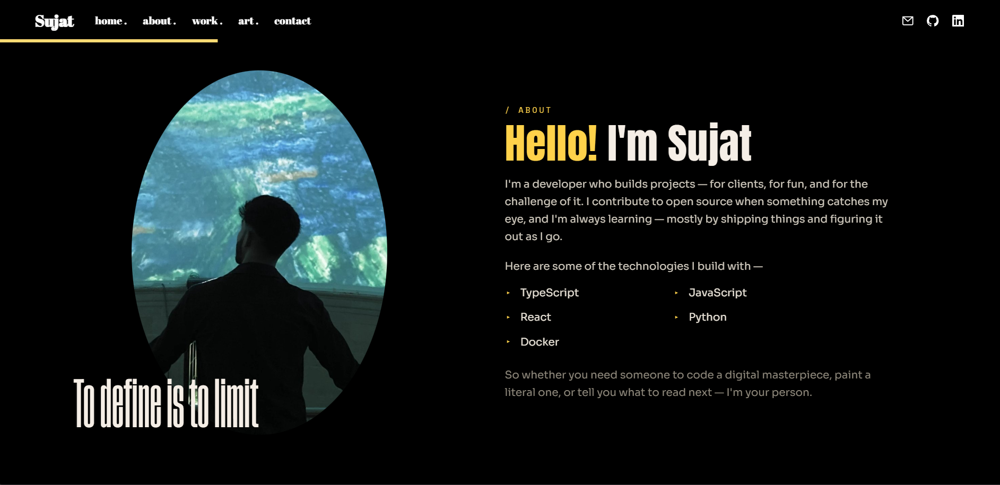

<p align="center">
  
</p>
<h1 align="center">
  sujatkhan.me
</h1>
<p align="center">
  Personal website of <a href="https://github.com/Sujatx" target="_blank">Sujat Khan</a> — built with React 18 and Tailwind CSS, animated with Framer Motion.
</p>
<p align="center">
  
</p>

## set-up

1. Install the dependencies

   ```sh
   npm install
   ```

2. Start the development server

   ```sh
   npm start
   ```

## build and run for production

1. Generate a full static production build

   ```sh
   npm run build
   ```

## color codes

| Color          | Hex                                                                |
| -------------- | ------------------------------------------------------------------ |
| Background     |  `#16130f` |
| Yellow         |  `#FFD24A` |
| Primary Text   |  `#F5EEE6` |
| Secondary Text |  `#CFC9BD` |
| Muted Text     |  `#8F897C` |
