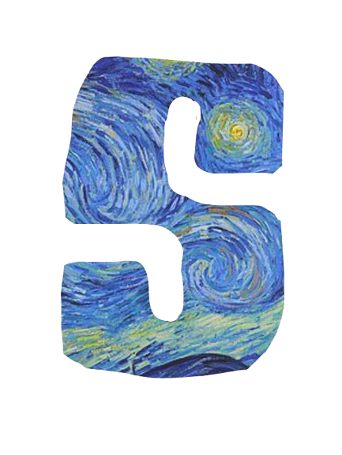
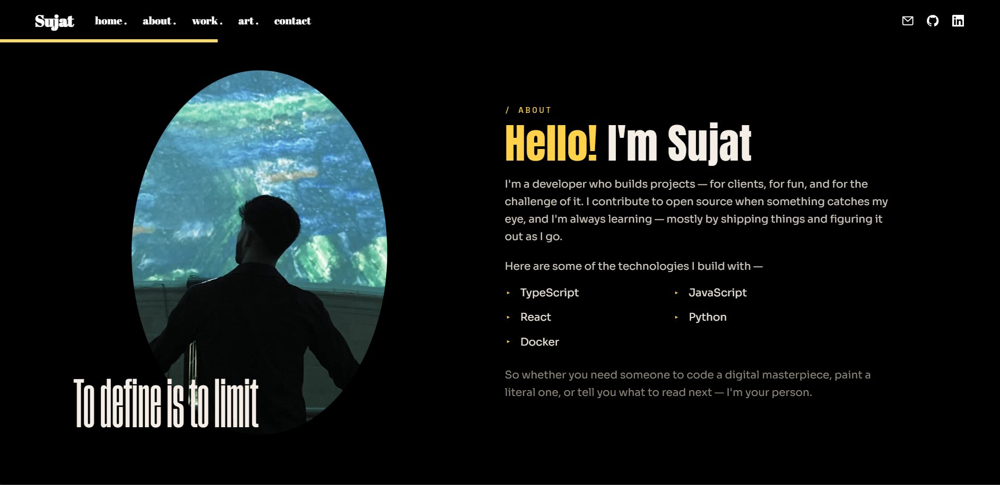

<p align="center">
  
</p>
<h1 align="center">
  sujatkhan.me
</h1>
<p align="center">
  Personal website of <a href="https://github.com/Sujatx" target="_blank">Sujat Khan</a> — built with React 18 and Tailwind CSS, animated with Framer Motion.
</p>
<p align="center">
  
</p>

## set-up

1. Install the dependencies

   ```sh
   npm install
   ```

2. Start the development server

   ```sh
   npm start
   ```

## build and run for production

1. Generate a full static production build

   ```sh
   npm run build
   ```

## design tokens

Every colour, type size, space step and radius resolves to a custom property
declared in `:root` in [`src/index.css`](src/index.css). Components read them as
`var(--token)`; nothing hardcodes a hex or a px type size. Only the tokens
reached through a class (`text-primaryFont`, `text-yellow`, `rounded-lg`) are
mirrored into [`tailwind.config.js`](tailwind.config.js).

| Token           | Hex                                                                   | Role                          |
| --------------- | --------------------------------------------------------------------- | ----------------------------- |
| `--accent`      |  `#FFDA73` | The one accent hue            |
| `--accent-ink`  |  `#16130F` | Text sitting on an accent fill |
| `--ink`         |  `#F5EEE6` | Headings, active items        |
| `--ink-2`       |  `#CFC9BD` | Body copy                     |
| `--ink-3`       |  `#8F897C` | Meta, tech lists              |
| `--surface`     |  `#0B0A09` | Cards, spotlight panel        |

Two shared layout classes pair with the tokens: `.section-shell` sets the
horizontal gutters and max width used from About down to the footer, and
`.section-block` sets the matching vertical rhythm.

## type

| Family          | Source        | Used for                                  |
| --------------- | ------------- | ----------------------------------------- |
| Tusker Grotesk  | local         | Hero and footer display lines             |
| Anton           | Google Fonts  | Section headings, project titles          |
| Jacquard 24     | Google Fonts  | Hero date, labels, the ampersand          |
| Sora            | local         | Body copy                                 |
| Space Mono      | Google Fonts  | Uppercase micro-labels                    |
| Abril Fatface   | local         | Nav and call-to-action buttons            |

## structure

```
src/
├── pages/        home, about, work, art, footer — one section each
├── fragments/    shared components (navbar, spotlight, cards, icons, headings, CTA)
├── lib/          non-component modules (mail links)
├── data/         projects.json — drives the work section
├── assets/       fonts and images bundled through webpack
├── index.css     design tokens, layout shells, @font-face
└── App.js        section order and the fixed background
```

Project imagery lives in `public/images/projects/` and is referenced by path
from `src/data/projects.json`. A project is featured in the spotlight carousel
when it carries `"featured": true`; the rest fall through to the card grid.
